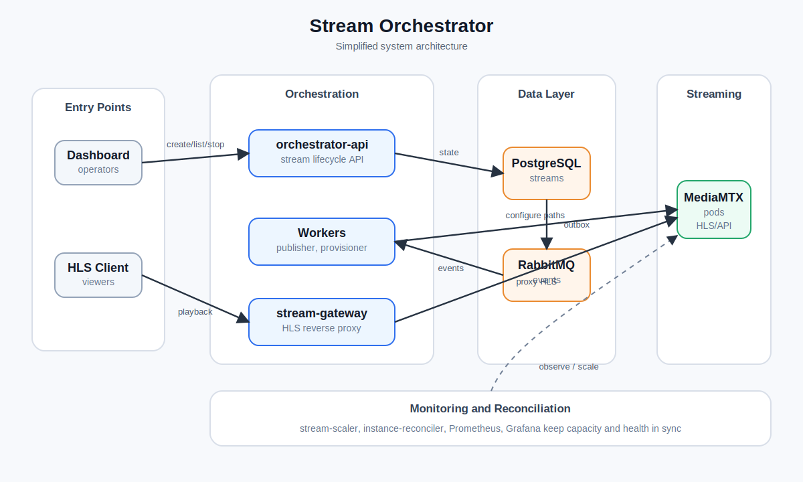

# Architecture

The system is organized around a small orchestration control plane and a MediaMTX-backed streaming data plane.

## Request Flow

1. An operator creates a stream through the dashboard or directly through `orchestrator-api`.
2. The API stores the stream in PostgreSQL with `PENDING` status and writes an outbox event.
3. `outbox-publisher` publishes pending stream events to RabbitMQ.
4. `stream-provisioner` consumes the event, selects a healthy MediaMTX instance, configures the MediaMTX path, and marks the stream as `RUNNING`.
5. HLS clients request `/hls/{stream_key}/...` through `stream-gateway`.
6. `stream-gateway` resolves the stream assignment from PostgreSQL and proxies playback to the assigned MediaMTX pod.

## Control Plane

The control plane owns stream state, event delivery, provisioning, scaling, and health reconciliation.

| Area | Components |
| --- | --- |
| API | `orchestrator-api` |
| Events | `outbox-publisher`, RabbitMQ |
| Provisioning | `stream-provisioner` |
| Playback routing | `stream-gateway` |
| Capacity | `stream-scaler` |
| Health | `instance-reconciler` |
| Persistence | PostgreSQL |

## Streaming Layer

MediaMTX runs as a Kubernetes StatefulSet. Stream paths are created and removed through the MediaMTX control API, while HLS playback is served by the assigned MediaMTX pod.

## Monitoring

Prometheus scrapes MediaMTX and Kubernetes metrics. Grafana exposes dashboards for stream and instance visibility. The scaler and reconciler use database and runtime state to keep the system aligned with demand.
