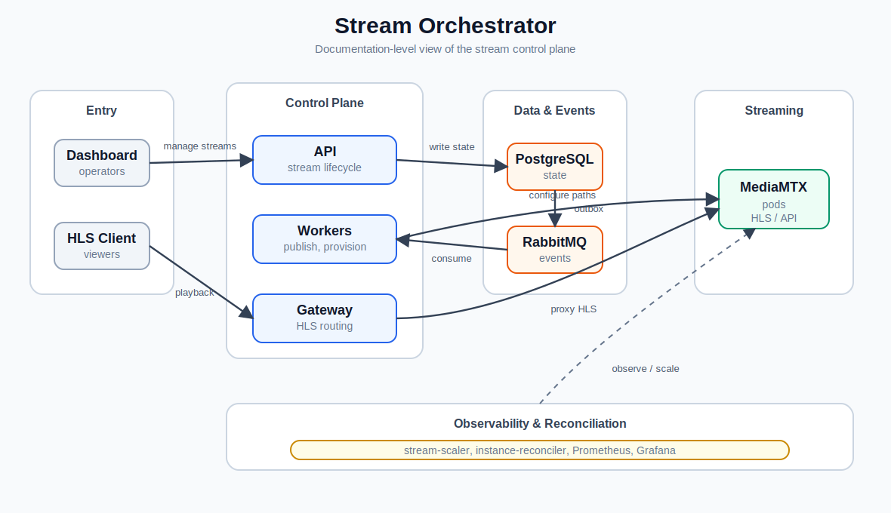

# Architecture

The system is organized around a small orchestration control plane and a MediaMTX-backed streaming data plane.

[Open the architecture diagram](architecture-diagram.svg)

## Request Flow

1. An operator creates a stream through the dashboard or directly through `orchestrator-api`.
2. The API stores the stream in PostgreSQL with `PENDING` status and writes an outbox event.
3. `outbox-publisher` publishes pending stream events to RabbitMQ.
4. `stream-provisioner` consumes the event, selects a healthy MediaMTX instance, configures the MediaMTX path, and marks the stream as `RUNNING`.
5. HLS clients request `/hls/{stream_key}/...` through `stream-gateway`.
6. `stream-gateway` resolves the stream assignment from PostgreSQL and proxies playback to the assigned MediaMTX pod.

## Components

| Area | Components |
| --- | --- |
| API | `orchestrator-api` |
| Events | `outbox-publisher`, RabbitMQ |
| Provisioning | `stream-provisioner` |
| Playback routing | `stream-gateway` |
| Capacity | `stream-scaler` |
| Health | `instance-reconciler` |
| Persistence | PostgreSQL |
