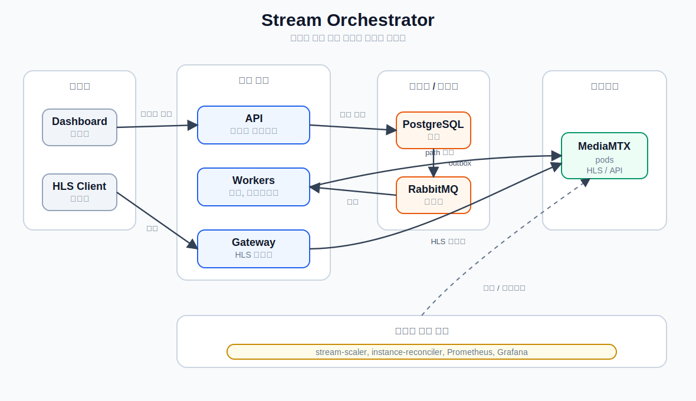

# 아키텍처

Stream Orchestrator는 작은 오케스트레이션 제어 평면과 MediaMTX 기반 스트리밍 데이터 평면으로 구성됩니다.

[아키텍처 도표 열기](architecture-diagram.svg)

## 요청 흐름

1. 운영자가 대시보드 또는 `orchestrator-api`를 통해 스트림을 생성합니다.
2. API는 PostgreSQL에 스트림을 `PENDING` 상태로 저장하고 outbox 이벤트를 기록합니다.
3. `outbox-publisher`가 pending 스트림 이벤트를 RabbitMQ로 발행합니다.
4. `stream-provisioner`가 이벤트를 소비하고, 건강한 MediaMTX 인스턴스를 선택한 뒤 MediaMTX path를 설정하고 스트림을 `RUNNING` 상태로 변경합니다.
5. HLS 클라이언트는 `stream-gateway`를 통해 `/hls/{stream_key}/...` 경로로 재생을 요청합니다.
6. `stream-gateway`는 PostgreSQL에서 스트림 할당 정보를 조회하고, 할당된 MediaMTX pod로 재생 요청을 프록시합니다.

## 컴포넌트

| 영역 | 컴포넌트 |
| --- | --- |
| API | `orchestrator-api` |
| 이벤트 | `outbox-publisher`, RabbitMQ |
| 프로비저닝 | `stream-provisioner` |
| 재생 라우팅 | `stream-gateway` |
| 용량 관리 | `stream-scaler` |
| 상태 동기화 | `instance-reconciler` |
| 영속성 | PostgreSQL |
